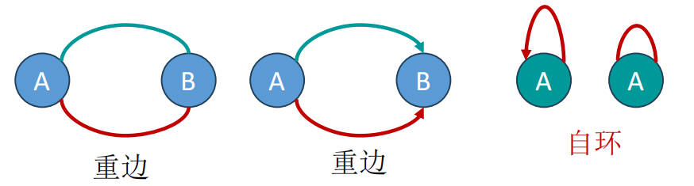

# 图

<!-- toc -->
- [图](#图)
  - [图的基本概念](#图的基本概念)
    - [图的基本组成](#图的基本组成)
    - [图的特殊类型](#图的特殊类型)
    - [图的路径和连通性](#图的路径和连通性)
    - [树和子图](#树和子图)
    - [线性结构、树结构、图结构的比较](#线性结构树结构图结构的比较)
  - [图的存储实现](#图的存储实现)
    - [邻接矩阵存储法](#邻接矩阵存储法)
      - [邻接矩阵（Adjacency Matrix）](#邻接矩阵adjacency-matrix)
      - [加权邻接矩阵（Weighted Adjacency Matrix）](#加权邻接矩阵weighted-adjacency-matrix)
      - [邻接矩阵与加权邻接矩阵对比](#邻接矩阵与加权邻接矩阵对比)
      - [邻接矩阵的适应情况和特殊图的存储处理](#邻接矩阵的适应情况和特殊图的存储处理)
    - [邻接表存储法](#邻接表存储法)
      - [邻接表（Adjacency List）](#邻接表adjacency-list)
      - [邻接表的存储特点](#邻接表的存储特点)
      - [特殊的邻接表存储](#特殊的邻接表存储)
    - [图的两种存储方式对比](#图的两种存储方式对比)
  - [图结构的ADT](#图结构的adt)
    - [邻接矩阵存储下的图ADT代码实现](#邻接矩阵存储下的图adt代码实现)
    - [邻接表存储下的图ADT代码实现](#邻接表存储下的图adt代码实现)
  - [图的遍历](#图的遍历)
    - [什么是图的遍历](#什么是图的遍历)
    - [图的两种遍历方法概述](#图的两种遍历方法概述)
    - [图的遍历与树的遍历对比](#图的遍历与树的遍历对比)
    - [BFS \& DFS 算法代码实现](#bfs--dfs-算法代码实现)
      - [BFS基本算法思想](#bfs基本算法思想)
      - [BFS代码实现](#bfs代码实现)
      - [DFS基本算法思想](#dfs基本算法思想)
      - [DFS的代码实现](#dfs的代码实现)
      - [`unordered_map` VS `vector`](#unordered_map-vs-vector)

## 图的基本概念

### 图的基本组成

- **图（Graph）**：可以用一个二元组\(G = (V,E)\)表示，其中\(V\)是顶点的非空集合，\(E\)是两个顶点间边（弧）的集合。
- **无向边（Undirected Edge）**：不带有方向的边，用圆括号 \( (vi, vj) \) 表示，意味着顶点 \( vi \) 和 \( vj \) 之间有一条边，并且这条边没有方向。此时，\( vi \) 和 \( vj \) 是互相邻接的，边 \( (vi, vj) \) 邻接于顶点 \( vi \) 和 \( vj \)。
- **无向图（Undirected Graph）**：由顶点集和无向边集合组成的图。
- **有向边（Directed Edge）**：带有方向的边，用尖括号 \( \langle vi, vj \rangle \) 表示，表示有一个从 \( vi \) 指向 \( vj \) 的边。在这种情况下，\( vi \) **邻接到** \( vj \)，而 \( vj \) 是 \( vi \) 的邻接点，边 \( \langle vi, vj \rangle \) 邻接于顶点 \( vi \)。
- **有向图（Directed Graph）**：由顶点集和有向边集合组成的图。
- **度（Degree）**：无向图中一个顶点的度是指邻接于该顶点的边的总数。
- **出度和入度（Out-degree and In-degree）**：有向图中，出度是指由一个顶点射出的边的数量，入度是指射入一个顶点的边的数量。

### 图的特殊类型

- **简单图（Simple Graph）**：没有自环和重边的图。

- **无向完全图（Undirected Complete Graph）**：无向图中边的数量达到最大，为 \(n(n-1)/2\) 的图。
- **有向完全图（Directed Complete Graph）**：有向图中边的数量达到最大，为 \(n(n-1)\) 的图。
- **加权图（Weighted Graph）**：边上带有权重的图，包括**加权有向图**和**加权无向图**。
- **网络（Network）**：加权有向图和加权无向图统称为网络。

### 图的路径和连通性

- **路径（Path）**：一条路径是指在图中从顶点 \( v_i \) 出发，经过一系列顶点到达顶点 \( v_j \) 的顶点序列，其中每一对连续的顶点都由图中的边直接连接。
- **路径的长度（Length of a Path）**：路径的长度由路径上边的数量定义，即顶点 \( v_i \) 到顶点 \( v_j \) 之间路径上边的数目。此外，如果边上有权重，路径长度也可以用路径上所有边的权重之和来表示。
- **简单路径（Simple Path）**：在路径中所有的顶点都不重复出现的路径，也就是说，除了**起点和终点可能相同**外，路径中的所有其他顶点都是唯一的。
- **简单回路或简单环（Simple Cycle or Simple Circuit）**：**起点和终点为同一顶点**的**简单路径**，且除起点和终点外，不包含重复的顶点或边。
- **连通（Connectivity）**：在图中，如果两个顶点之间**存在路径**，则称这两个顶点是连通的。
- **连通图（Connected Graph）**：**无向图**中任意两个顶点对之间都是连通的图。
  - 在图论中，连通图的定义通常是指无向图，这是因为：在无向图中，连通性的定义是直观的，即“如果图中任意两个顶点之间都存在路径，则该图是连通的。”这意味着从任何一个顶点都可以到达图中的任何其他顶点，而不需要考虑路径的方向性，因为无向图的边是双向的。
  - 对于有向图，这种无差别的连通性概念并不适用，因为有向图的边是有方向的，从顶点 A 到顶点 B 可能存在路径，而从顶点 B 到顶点 A 则可能不存在路径。因此，有向图有更具体的连通性定义：**强连通图与弱连通图**。
  - 因此，当我们说一个图是连通的，如果没有特别指明，就默认是指无向图的连通性。而有向图的连通性通常需要用“强连通”或“弱连通”来具体描述。
- **强连通图（Strongly Connected Graph）**：**有向图**中任意两个顶点对之间都是连通的图。
- **弱连通图（Weakly Connected Graph）**：将有向图的边换成**无向边**后，如果图是连通的，则该有向图是弱连通的。
- **强连通分量（Strongly Connected Components）**：有向图的极大连通子图。

### 树和子图

- **树（Tree）**：无回路的连通图。
- **生成树（Spanning Tree）**：连通图的**极小连通子图**，包含**所有顶点**但**只有\(n-1\) 条边**。
  - **极小连通子图（Minimally Connected Subgraph）**：拥有极小边集（它包含的边是保持子图连通性所必需的最小集合）的一个连通图的子图。在极小连通子图中，任何边的添加都会形成一个回路，任何边的删除都会破坏连通性。因此，它是构成连通图的最基本的骨架。
  - **极小性**：生成树含有极少量的边，使得图保持连通。对于含有 \( n \) 个顶点的图，其生成树恰好有 \( n-1 \) 条边。尽管边数是最小的，生成树仍然包括图中的所有顶点。
  - **不唯一性**：对于同一个连通图，可能存在多个不同的生成树，但每个生成树都满足上述的定义条件。在某些应用中，我们可能会寻找某种最优的生成树，如最小生成树（Minimum Spanning Tree），它在所有生成树中边的权重和最小。常见的最小生成树算法包括普里姆算法（Prim's Algorithm）和克鲁斯卡尔算法（Kruskal's Algorithm）。
- **子图（Subgraph）**：由原图的一部分顶点和边组成的图。

### 线性结构、树结构、图结构的比较

| 特点/结构    | 线性结构     | 树结构              | 图结构                |
|--------------|--------------|---------------------|----------------------|
| **定义**       | 数据元素的有序集合 | 一种层次化的数据结构，由节点（顶点）和边组成 | 由顶点集合和边集合组成的结构 |
| **顺序性**     | 有明确的线性顺序   | 无明确的线性顺序，有层级关系 | 无顺序性，顶点间通过边以任意方式连接 |
| **连接方式**   | 每个元素最多连接两个方向（前一个和后一个） | 父节点和子节点之间单向连接，子节点数量不固定 | 顶点之间可以任意多边连接，可以是有向或无向 |
| **循环性**     | 通常不允许循环   | 不允许闭环（回路），有且仅有一个根节点 | 可以有也可以没有循环（回路） |
| **分支性**     | 没有分支     | 每个节点可以有多个分支（子节点） | 顶点可以有多个连接点，形成复杂的网络结构 |
| **方向性**     | 通常是单向的   | 从根到叶的单向路径 | 可以是无向的，也可以是有向的 |
| **示例**       | 数组、链表    | 二叉树、多叉树         | 社交网络、交通网络  |
| **路径唯一性** | 每对元素间的路径唯一 | 从根到任意节点的路径唯一 | 路径可能有多个，不唯一 |
| **应用**       | 数据表示具有序关系时 | 表示具有层级关系的数据 | 表示复杂的网络关系，如社交网络、地图等 |

## 图的存储实现

### 邻接矩阵存储法

#### 邻接矩阵（Adjacency Matrix）

邻接矩阵是表示图中顶点之间的关系的一种方法。在这种存储结构中，我们使用**一维数组**来存放顶点，用一个**二维矩阵**来表示顶点间的边。

- **数组定义**：如果图中有`n`个顶点，我们定义一个`n x n`的矩阵，矩阵的每个元素表示两个顶点之间是否有边。
- **元素表示**：矩阵中的元素`a[i][j]`表示顶点`i`到顶点`j`是否存在一条边。
  - 对于非加权图，如果`i`和`j`之间有边，`a[i][j] = 1`；如果没有边，`a[i][j] = 0`。
  - 对于加权图，`a[i][j]`可以表示`i`和`j`之间边的权重。
- **特点**：
  - 对于无向图，邻接矩阵是对称的（以主对角线）。即`a[i][j] = a[j][i]`。
  - 对于简单图，主对角线上元素`a[i][i] = 0`，即顶点到自身没有边相连。

**邻接矩阵存储图各项操作的时间复杂度:**

| 操作                   | 时间复杂度    | 解释                                                         |
|------------------------|------------|--------------------------------------------------------------|
| 检查两个顶点是否相邻（有无边连接）          | \( O(1) \) | 通过直接访问矩阵的对应元素来确定两个顶点是否相邻。                    |
| 查找给定顶点的所有邻居（计算结点的度）        | \( O(n) \) | 遍历矩阵中给定顶点对应的行或列，找到所有的邻居。                         |
| 查找度最大的结点            | \( O(n^2) \) | 需要遍历矩阵的每一行，计算所有顶点的度，然后找出度最大的顶点。              |
| 添加或删除一个顶点          | \( O(?) \) | 添加或删除顶点涉及到矩阵维度的变化，需要重新构造整个矩阵。                   |
| 添加或删除一条边            | \( O(1) \) | 直接修改两个顶点对应的矩阵元素即可添加或删除一条边。                        |

#### 加权邻接矩阵（Weighted Adjacency Matrix）

- 矩阵的行和列对应图中的顶点。
- 矩阵中的元素表示顶点之间边的权重。
  - 如果顶点`i`和`j`之间存在边，则`a[i][j]`表示这条边的权重。
  - 如果顶点`i`和`j`之间没有边，则`a[i][j]`通常设置为一个非常大的数（例如`∞`），或者在某些实现中，可能设置为一个特殊的标记值，以表示这两个顶点之间没有直接的连接。
- 对于无向加权图，邻接矩阵是对称的，即`a[i][j]`和`a[j][i]`相等，因为边是无向的，从`i`到`j`的权重与从`j`到`i`的权重是相同的。
- 对于自环（即顶点到自己的边），如果允许自环存在，它们会在主对角线上表示，即`a[i][i]`表示顶点`i`的自环的权重。其它情况下，该值一般设为\(0\)。

#### 邻接矩阵与加权邻接矩阵对比

| 特性 | 邻接矩阵 | 加权邻接矩阵 |
|------|---------|-------------|
| 查找边的存在性 | 快速（时间复杂度 \( O(1) \)） | 快速（时间复杂度 \( O(1) \)） |
| 修改边的信息 | 快速（时间复杂度 \( O(1) \)） | 快速但权重更新成本高 |
| 顶点的度数计算 | 无向图：行/列非零元素个数；有向图：行非零元素个数为出度，列非零元素个数为入度 | 同邻接矩阵 |
| 空间效率 | 低（需 \( n^2 \) 内存单元，不适合稀疏图） | 同邻接矩阵 |
| 适用性 | 不适合大规模稀疏图 | 同邻接矩阵 |
| 特殊功能 | - | 直接表示边权重，统一表示有权和无权图 |
| 初始化复杂度 | 一般 | 较高（需特殊处理不存在的边） |

#### 邻接矩阵的适应情况和特殊图的存储处理

- **稠密图的存储**

  - **有向图**：如果图是稠密的，即边的数量接近顶点对的数量，那么使用邻接矩阵来存储有向图是合适的。因为大部分的顶点对之间都存在边，所以邻接矩阵中将会有**很少的空白**（或标记为无穷大的）位置，这使得空间的利用效率较高。
  - **无向图**：无向图的邻接矩阵是关于主对角线对称的。由于这种对称性，我们不必存储整个矩阵。我们只需要存储**上三角或下三角**部分（包括主对角线），这可以减少存储空间的需求。

- **稀疏图的存储**

  - 当图是稀疏的，即边的数量远少于顶点对的数量时，使用传统的邻接矩阵存储会造成大量的空间浪费，因为矩阵中的大部分位置都会是空白或标记为无连接的值。
  - 在这种情况下，一个有效的存储策略是**仅存储那些非零元素及其位置信息**。每个非零元素`a[i][j]`（表示顶点`i`和`j`之间有一条边）用一个三元组`(i, j, a[i][j])`来表示。
  - 这些三元组可以根据顶点的编号顺序进行排序，通常是先按行排序，再按列排序。这样，我们可以快速定位到任意一个顶点的所有出边或入边。
  - 这些三元组可以存储在一个顺序表（数组）或者链表中，这取决于图的具体操作需求和边的动态变化情况。

在选择邻接矩阵作为图的存储结构时，必须考虑图的稠密度和边的分布特点。**对于稠密图，完整的邻接矩阵或其上/下三角表示是合理的；对于稀疏图，仅存储非零元素及其位置是更加高效的方法**。这样的选择可以在保证操作效率的同时，尽可能地减少存储空间的浪费。

### 邻接表存储法

#### 邻接表（Adjacency List）

邻接表是图的另一种存储方法，特别适用于**稀疏图**（即边的数量远少于顶点对数量的情况）。在邻接表中，图的表示由两部分组成：**顶点表**和**边表**。

1. **顶点表**：顶点表是一个**一维数组**，每个数组元素存储一个顶点的信息，并且包含一个指向该顶点的边表的首结点的指针（**首指针**）。这个指针实际上指向一个链表，该链表包含了所有从这个顶点出发的边的信息。

2. **边表**：每个顶点的边表是一个单链表，链表中的每个节点代表从该顶点出发的一条边。在无向图中，每条边在两个相关联的顶点的边表中各出现一次；在有向图中，每条边只出现在对应的起始顶点的边表中。

#### 邻接表的存储特点

- **空间效率**：邻接表仅存储有边的信息，不存储无边信息，这在稀疏图中大大提高了空间利用率。
- **出度的计算**：对于有向图，计算某个顶点的出度非常容易，只需要遍历该顶点的边表即可。对于无向图，遍历边表同样可以得到顶点的度。
- **入度的计算**：在普通的邻接表中，计算顶点的入度比较困难，因为需要检查图中所有顶点的边表。为了解决这个问题，有向图可以使用**逆邻接表**。
- **时间复杂度**：邻接表表示法的时间复杂度是 \( O(|V|+|E|) \)，或者当边数多于顶点数时，可以简化为 \( O(|E|) \)。

#### 特殊的邻接表存储

- **逆邻接表（Inverse Adjacency List）**：逆邻接表是邻接表的变体，专门用于有向图。在逆邻接表中，每个顶点的边表存储的是指向该顶点的边，也就是说，存储的是入边。这使得计算顶点的入度变得容易。

- **动态邻接表（Dynamic Adjacency List）**：传统的邻接表使用静态数组来存储顶点表，这需要在图初始化时预估数组规模。一种改进方法是使用单链表代替静态数组来表示顶点表，每个节点代表一个顶点。这种方法在**顶点数不确定**或者**图在运行时动态变化**时更加灵活。在这种情况下，边表中存储的可能不再是顶点的数组索引，而是指向顶点的指针或引用。

  - 使用链表来表示顶点表的邻接表使得顶点的添加和删除操作非常灵活，并且对于动态变化的图结构，这种方法特别有效。然而，必须注意的是，这种方法可能会使得查找特定顶点或边的操作变得相对复杂和耗时，因为可能需要遍历链表。
  - 该条件下添加或删除边或顶点的操作方法：
    - **添加顶点**：
      - 创建一个新的顶点节点。
      - 将新顶点节点插入到顶点链表中的适当位置。
      - 如果新顶点有边连接到其他顶点，为这些边创建新的边节点，并将它们添加到新顶点的边链表中。

    - **删除顶点**：
      - 从顶点链表中移除顶点节点。
      - 遍历所有其他顶点的边链表，移除指向被删除顶点的边节点。
      - 如果被删除的顶点有自己的边链表，释放与之相关的所有边节点。

    - **添加边**：
      - 确定边的起点和终点顶点。
      - 在起点顶点的边链表中创建一个新的边节点，并设置它的指针指向终点顶点。
      - 如果是无向图，还需要在终点顶点的边链表中添加一个指向起点顶点的边节点。

    - **删除边**：
      - 确定边的起点和终点顶点。
      - 在起点顶点的边链表中找到并删除相应的边节点。
      - 如果是无向图，还需要在终点顶点的边链表中找到并删除指向起点顶点的边节点。

***邻接多重表与十字链表未列出***

### 图的两种存储方式对比

| 特点/存储法          | 邻接矩阵                               | 邻接表                                      |
|---------------------|----------------------------------------|-------------------------------------------|
| **空间效率**         | 较低，需要为每一对顶点分配空间           | 较高，只为存在的边分配空间                   |
| **存储方式**         | 二维矩阵                               | 一维数组（顶点表）+ 链表（边表）              |
| **适用场景**         | 稠密图，顶点多且边也多                 | 稀疏图，边相对顶点较少                       |
| **边的检索效率**     | 高，可以直接通过矩阵索引访问           | 低，可能需要遍历链表                          |
| **添加/删除边的效率** | 高，直接修改矩阵元素                   | 取决于链表操作，一般较低                       |
| **添加/删除顶点的效率** | 低，需要重新构造整个矩阵               | 较高，只需修改顶点表和相关链表                |
| **存储边的信息**     | 每对顶点间的关系都有存储（即使没有边） | 只存储实际存在的边                            |
| **图的类型表示**     | 无向图的邻接矩阵是对称的               | 无向图中，每条边在两个顶点的链表中各出现一次   |
| **计算顶点的度**     | 直接计算                               | 出度容易计算（遍历边表），入度计算较困难       |

## 图结构的ADT

1. **数据对象**：图的数据对象主要是顶点（Vertex）的集合。每个顶点都是图的一个基本单位。

2. **数据关系**：图中的数据关系由边（Edge）或弧（Arc）定义。边或弧连接两个顶点，代表它们之间的关系。在数学表示中，边或弧可以用顶点对来表示，例如，`(vi, vj)` 或 `<vi, vj>`。这里，`(vi, vj)` 表示无向边，而 `<vi, vj>` 表示有向边。函数 `P(vi, vj)` 定义了边或弧的具体信息或属性。

3. **基本操作**：
   - `InitGraph(graph, kMaxVertex, no_edge_value, directed)`: 初始化一个图。`kMaxVertex` 是最大顶点数，`no_edge_value` 是顶点间无边时的权值，`directed` 表示图是有向的还是无向的。
   - `CreateGraph(graph)`: 构造一个图。
   - `DestroyGraph(graph)`: 释放图占用的所有资源。
   - `NumberOfVex(graph)`: 返回图中顶点的数量。
   - `NumberOfEdge(graph)`: 返回图中边的数量。
   - `ExistEdge(graph, u, v)`: 判断顶点 `u` 到 `v` 之间是否存在边。
   - `GetPosition(graph, v)`: 返回顶点 `v` 在图中的位置。
   - `GetValue(graph, v)`: 返回图中顶点 `v` 的值。
   - `PutValue(graph, v, value)`: 为图中顶点 `v` 赋值 `value`。
   - `FirstAdjVex(graph, v)`: 返回图中顶点 `v` 的第一个邻接顶点。
   - `NextAdjVex(graph, u, v)`: 返回图中 `u` 顶点相对 `v` 顶点的下一个邻接顶点。
   - `InsertVex(graph, v)`: 在图中插入顶点 `v`。
   - `InsertEdge(graph, u, v, weight)`: 在图中顶点 `u` 和 `v` 之间插入一条边，权值为 `weight`。
   - `RemoveVex(graph, v)`: 在图中删除顶点 `v` 及其所有邻接边。
   - `RmoveEdge(graph, u, v)`: 在图中删除顶点 `u` 和 `v` 之间的边。
   - `DFS(graph)`: 对图进行深度优先遍历。
   - `DFS(graph, v, visited)`: 从顶点 `v` 开始进行深度优先遍历，`visited` 记录顶点的访问标记。
   - `BFS(graph)`: 对图进行广度优先遍历。
   - `BFS(graph, v, visited)`: 从顶点 `v` 开始进行广度优先遍历，`visited` 记录顶点的访问标记。

### 邻接矩阵存储下的图ADT代码实现

见`The ADT of Graph (adjMatrix).cpp`文件。

### 邻接表存储下的图ADT代码实现

见`The ADT of Graph (adjList).cpp`文件。

## 图的遍历

### 什么是图的遍历

图的遍历是指在图（Graph）这一数据结构中，按照某种规则系统地访问图中的每一个顶点，而且保证每一个顶点仅被访问一次。图遍历的主要目的是为了发现图的属性，如检查图中是否存在路径、环路、连接的各个部分等。

### 图的两种遍历方法概述

[两种遍历方法的概念讲授](https://www.bilibili.com/video/BV1T64y147r1?vd_source=b8f0cc4acb2951ad6eaeaee5256727aa)

图遍历的两种主要方法是**深度优先搜索（Depth-First Search, DFS）**和**广度优先搜索（Breadth-First Search, BFS）**。

1. **深度优先搜索（DFS）**：这种方法会尽可能深地搜索图的分支。DFS 会从图的一个未被访问的顶点开始，沿着一条路径走到底，直至没有未访问的相邻节点为止，然后回溯继续搜索下一条路径。DFS 通常用**递归**（Recursion）或**栈**（Stack）实现。

2. **广度优先搜索（BFS）**：这种方法会从图的一个未被访问的顶点开始，访问所有相邻的顶点，然后对每一个相邻的顶点重复同样的过程。BFS 通常用**队列**（Queue）来实现。

下面是DFS与BFS的对比表格：

| 特点 | 深度优先搜索（DFS） | 广度优先搜索（BFS） |
| --- | --- | --- |
| 搜索顺序 | 深入图的分支直到不可再深 | 按层遍历图中顶点 |
| 数据结构 | 栈（Stack）或递归（Recursion） | 队列（Queue） |
| 应用场景 | 寻找**全部方案**，如迷宫的所有路径 | 寻找**最短路径**，如在社交网络中寻找最短连接路径 |
| 空间复杂度 | \(O(V)\)，V为顶点数 | \(O(V)\)，V为顶点数 |
| 时间复杂度 | \(O(V+E)\)，V为顶点数，E为边数 | \(O(V+E)\)，V为顶点数，E为边数 |
| 特点 | 适合目标比较明确，要求全面搜索的情况 | 适合求解最短路径或接近问题 |

### 图的遍历与树的遍历对比

| 特点 | 图的遍历 | 二叉树的遍历 |
| ---- | ------- | ---------- |
| **顶点地位** | 所有顶点地位相同，无特殊顶点 | 有一个特殊的根结点 |
| **顶点的邻接关系** | 一个顶点可能与多个其他顶点邻接，可能有多个直接前驱和后继，可能存在回路 | 每个结点的直接前驱最多一个，直接后继最多两个（左右子结点），无回路 |
| **边的邻接关系** | 无向图中，邻接边的两个顶点可视作互为后继 | 不适用，因为二叉树的边代表父子关系 |
| **避免重复访问** | 需要特殊标记防止重复访问，因为可能存在环路 | 通常不需要特殊标记，因为无环路 |

### BFS & DFS 算法代码实现

#### BFS基本算法思想

[详细讲解图的BFS代码实现](https://www.bilibili.com/video/BV1s5411M7vz?vd_source=b8f0cc4acb2951ad6eaeaee5256727aa)

广度优先搜索（Breadth-First Search, BFS）是一种用于遍历或搜索图的算法。它的基本思想是从一个起始顶点开始，先访问所有与之相邻的顶点，再逐层向外扩展，直到所有可达的顶点都被访问到。BFS 通常使用**队列**来实现这种层次遍历。

**BFS算法实现大致步骤：**

1. **初始化队列**：首先，将起始顶点放入队列中。

2. **遍历队列**：当队列不为空时，进行遍历：
   - 从队列中弹出一个顶点。
   - 访问该顶点，并执行相关操作（比如打印顶点、检查顶点属性等）。
   - 将所有未访问过且与当前顶点相邻的顶点加入队列，并标记为已访问。

3. **重复过程**：重复步骤2，直到队列为空。

**关键点：**

- **使用队列**：BFS 使用队列数据结构（FIFO）来保持待访问顶点的顺序，确保每次都是从最早加入队列的顶点开始扩展。
- **标记已访问顶点**：为了防止一个顶点被重复访问（尤其是在图中），需要对已经访问过的顶点进行标记。

通过这种方式，BFS 能够按照从近到远的顺序访问图中的每个顶点且 BFS 特别适合用于找到从起点到其他顶点的最短路径（在边权重相同的情况下）。

#### BFS代码实现

见`BFS of Example Graph.cpp`文件。

#### DFS基本算法思想

[详细讲解图的DFS代码实现](https://b23.tv/XWotFVJ)

深度优先搜索（Depth-First Search, DFS）是一种用于遍历或搜索树或图的算法。与广度优先搜索不同，深度优先搜索的核心思想是尽可能深地搜索图的分支。

**DFS算法实现大致步骤：**

1. **选择起始点**：从一个顶点开始，作为搜索的起始点。

2. **探索未访问的分支**：
   - 访问当前顶点，并进行标记为已访问。
   - 查找当前顶点的所有邻接顶点，对于每一个未访问的邻接顶点，继续进行深度优先搜索。

3. **回溯**：当当前顶点的所有邻接顶点都已访问或没有邻接顶点时，回溯到上一个顶点，继续执行步骤2。

4. **重复过程**：重复步骤2和3，直到所有可达的顶点都被访问到。

**关键点：**

- **递归实现**：DFS 通常通过**递归**来实现。在每一层递归中，选择一个邻接顶点进行探索，直到无法继续为止。
- **使用栈**：除了递归，DFS 也可以使用**栈**来实现。在这种实现中，利用栈保存待访问的顶点。
- **标记已访问顶点**：为了避免重复访问同一顶点，需要对已访问的顶点进行标记。

DFS的这种深入探索的特性使它非常适合于需要深度遍历的场景，如寻找所有可能的解决方案，检测环路，或者在图中搜索从一个顶点到另一个顶点的路径。由于它会尽可能深地探索，直到无法继续为止，然后回溯，因此它也适用于找到路径或者解决方案的所有可能性。

#### DFS的代码实现

见`DFS of Example Graph.cpp`文件。

**注意：**

- DFS可以通过使用栈来实现非递归版本，栈用于明确地维护访问过程中的回溯路径。但在我们这个递归实现中，这种回溯是隐式的，由函数调用栈（function call stack）管理。每次递归调用DFS相当于在函数调用栈上“压入”一个新的层级，而当递归调用完成返回时，相当于从栈中“弹出”这个层级。

- 在我们这个递归实现过程中，将不会直接看到一个栈的数据结构，因为递归本身就是通过函数调用栈来实现的。递归实现通常更简洁，但在深度很大的图中可能导致栈溢出。而非递归实现（显式使用栈）可以避免这个问题，但代码通常更复杂。所以如果我们需要处理非常大的图或者想避免递归导致的栈溢出问题，可以考虑使用显式栈的非递归实现。

#### `unordered_map` VS `vector`

注意到，在BFS代码实现中我们用`vector`这一数据结构来存储图，而在DFS代码实现中我们用`unordered_map`来存储图。实际上，在实现BFS和DFS时，选择哪种数据结构来存储图（如`unordered_map`或`vector`）主要取决于图本身的特性以及特定的应用需求，而没有固定的要求，我们可以根据需要灵活选择。

下面是两者的对比：

| **特性/考量**         | **unordered_map**                                                                                                 | **vector**                                                                                           |
|-------------------|---------------------------------------------------------------------------------------------------------------|----------------------------------------------------------------------------------------------------|
| **数据结构类型**     | 关联容器，基于哈希表实现。                                                                                           | 序列容器，提供快速的顺序访问。                                                                           |
| **访问速度**         | 平均情况下访问时间为\(O(1)\)，但最坏情况下为\(O(n)\)。                                                                       | 访问时间总是\(O(1)\)。                                                                                  |
| **内存分布**         | 内存分布不连续。                                                                                                | 内存分布连续。                                                                                      |
| **顶点编号连续性**    | 适合处理顶点编号不连续或未知的图。                                                                                    | 适合处理顶点编号连续且数量已知的图。                                                                     |
| **动态性**          | 可以动态地添加和删除顶点和边，更适合于动态变化的图。                                                                   | 在图结构固定时更有效，对动态变化的图可能不够灵活。                                                         |
| **适用场景**        | 适用于复杂或大型图，特别是当顶点和边的添加/删除操作频繁时。                                                              | 适用于结构简单、顶点数量固定的图。                                                                     |
| **性能考虑**        | 由于基于哈希表，性能可能受哈希函数和冲突处理机制的影响。                                                               | 由于内存连续，可以提供高效的缓存利用率，但可能在大型图中因为内存重新分配而影响性能。                            |
| **初始化复杂性**     | 不需要提前知道顶点数量，更易于处理图的动态变化。                                                                        | 需要预先知道顶点数量以分配内存，适用于静态图。                                                           |
