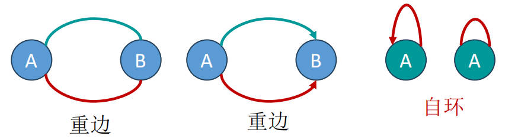

# 图的基础知识

## 图的基本概念

### 1. 图的基本组成

- **图（Graph）**：可以用一个二元组\(G = (V,E)\)表示，其中\(V\)是顶点的非空集合，\(E\)是两个顶点间边（弧）的集合。
- **无向边（Undirected Edge）**：不带有方向的边，用圆括号 \( (vi, vj) \) 表示，意味着顶点 \( vi \) 和 \( vj \) 之间有一条边，并且这条边没有方向。此时，\( vi \) 和 \( vj \) 是互相邻接的，边 \( (vi, vj) \) 邻接于顶点 \( vi \) 和 \( vj \)。
- **无向图（Undirected Graph）**：由顶点集和无向边集合组成的图。
- **有向边（Directed Edge）**：带有方向的边，用尖括号 \( \langle vi, vj \rangle \) 表示，表示有一个从 \( vi \) 指向 \( vj \) 的边。在这种情况下，\( vi \) **邻接到** \( vj \)，而 \( vj \) 是 \( vi \) 的邻接点，边 \( \langle vi, vj \rangle \) 邻接于顶点 \( vi \)。
- **有向图（Directed Graph）**：由顶点集和有向边集合组成的图。
- **度（Degree）**：无向图中一个顶点的度是指邻接于该顶点的边的总数。
- **出度和入度（Out-degree and In-degree）**：有向图中，出度是指由一个顶点射出的边的数量，入度是指射入一个顶点的边的数量。

### 2. 图的特殊类型

- **简单图（Simple Graph）**：没有自环和重边的图。

- **无向完全图（Undirected Complete Graph）**：无向图中边的数量达到最大，为 \(n(n-1)/2\) 的图。
- **有向完全图（Directed Complete Graph）**：有向图中边的数量达到最大，为 \(n(n-1)\) 的图。
- **加权图（Weighted Graph）**：边上带有权重的图，包括**加权有向图**和**加权无向图**。
- **网络（Network）**：加权有向图和加权无向图统称为网络。

### 3. 图的路径和连通性

- **路径（Path）**：一条路径是指在图中从顶点 \( v_i \) 出发，经过一系列顶点到达顶点 \( v_j \) 的顶点序列，其中每一对连续的顶点都由图中的边直接连接。
- **路径的长度（Length of a Path）**：路径的长度由路径上边的数量定义，即顶点 \( v_i \) 到顶点 \( v_j \) 之间路径上边的数目。此外，如果边上有权重，路径长度也可以用路径上所有边的权重之和来表示。
- **简单路径（Simple Path）**：在路径中所有的顶点都不重复出现的路径，也就是说，除了**起点和终点可能相同**外，路径中的所有其他顶点都是唯一的。
- **简单回路或简单环（Simple Cycle or Simple Circuit）**：**起点和终点为同一顶点**的**简单路径**，且除起点和终点外，不包含重复的顶点或边。
- **连通（Connectivity）**：在图中，如果两个顶点之间**存在路径**，则称这两个顶点是连通的。
- **连通图（Connected Graph）**：**无向图**中任意两个顶点对之间都是连通的图。
  - 在图论中，连通图的定义通常是指无向图，这是因为：在无向图中，连通性的定义是直观的，即“如果图中任意两个顶点之间都存在路径，则该图是连通的。”这意味着从任何一个顶点都可以到达图中的任何其他顶点，而不需要考虑路径的方向性，因为无向图的边是双向的。
  - 对于有向图，这种无差别的连通性概念并不适用，因为有向图的边是有方向的，从顶点 A 到顶点 B 可能存在路径，而从顶点 B 到顶点 A 则可能不存在路径。因此，有向图有更具体的连通性定义：**强连通图与弱连通图**。
  - 因此，当我们说一个图是连通的，如果没有特别指明，就默认是指无向图的连通性。而有向图的连通性通常需要用“强连通”或“弱连通”来具体描述。
- **强连通图（Strongly Connected Graph）**：**有向图**中任意两个顶点对之间都是连通的图。
- **弱连通图（Weakly Connected Graph）**：将有向图的边换成**无向边**后，如果图是连通的，则该有向图是弱连通的。
- **强连通分量（Strongly Connected Components）**：有向图的极大连通子图。

### 4. 树和子图

- **树（Tree）**：无回路的连通图。
- **生成树（Spanning Tree）**：连通图的**极小连通子图**，包含**所有顶点**但**只有\(n-1\) 条边**。
  - **极小连通子图（Minimally Connected Subgraph）**：拥有极小边集（它包含的边是保持子图连通性所必需的最小集合）的一个连通图的子图。在极小连通子图中，任何边的添加都会形成一个回路，任何边的删除都会破坏连通性。因此，它是构成连通图的最基本的骨架。
  - **极小性**：生成树含有极少量的边，使得图保持连通。对于含有 \( n \) 个顶点的图，其生成树恰好有 \( n-1 \) 条边。尽管边数是最小的，生成树仍然包括图中的所有顶点。
  - **不唯一性**：对于同一个连通图，可能存在多个不同的生成树，但每个生成树都满足上述的定义条件。在某些应用中，我们可能会寻找某种最优的生成树，如最小生成树（Minimum Spanning Tree），它在所有生成树中边的权重和最小。常见的最小生成树算法包括普里姆算法（Prim's Algorithm）和克鲁斯卡尔算法（Kruskal's Algorithm）。
- **子图（Subgraph）**：由原图的一部分顶点和边组成的图。

### 5. 线性结构、树结构、图结构的比较

| 特点/结构    | 线性结构     | 树结构              | 图结构                |
|--------------|--------------|---------------------|----------------------|
| **定义**       | 数据元素的有序集合 | 一种层次化的数据结构，由节点（顶点）和边组成 | 由顶点集合和边集合组成的结构 |
| **顺序性**     | 有明确的线性顺序   | 无明确的线性顺序，有层级关系 | 无顺序性，顶点间通过边以任意方式连接 |
| **连接方式**   | 每个元素最多连接两个方向（前一个和后一个） | 父节点和子节点之间单向连接，子节点数量不固定 | 顶点之间可以任意多边连接，可以是有向或无向 |
| **循环性**     | 通常不允许循环   | 不允许闭环（回路），有且仅有一个根节点 | 可以有也可以没有循环（回路） |
| **分支性**     | 没有分支     | 每个节点可以有多个分支（子节点） | 顶点可以有多个连接点，形成复杂的网络结构 |
| **方向性**     | 通常是单向的   | 从根到叶的单向路径 | 可以是无向的，也可以是有向的 |
| **示例**       | 数组、链表    | 二叉树、多叉树         | 社交网络、交通网络  |
| **路径唯一性** | 每对元素间的路径唯一 | 从根到任意节点的路径唯一 | 路径可能有多个，不唯一 |
| **应用**       | 数据表示具有序关系时 | 表示具有层级关系的数据 | 表示复杂的网络关系，如社交网络、地图等 |
